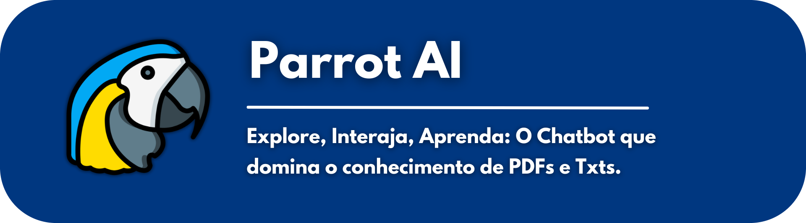
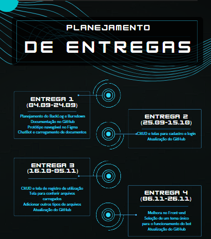

#

## O que é o C0deMain?
C0deMain, é um time de desenvolvimento web do 2°Semestre de Análise e Desenvolvimento da FATEC São José dos Campos - Prof. Jessen Vidal. A equipe possui como objetivo principal desenvolver  um  sistema  desktop de um bot que lê e interpreta arquivos, e baseando-se neles fornece respostas a qualquer pergunta.

# Projeto
 

Como parte da API do 2° semestre do curso de análise e desenvolvimento de sistemas, da faculdade Fatec São José dos Campos, um desafio é proposto aos alunos. O desafio proposto foi a criação de um chat bot utilizando a linguagem de programação java junto da biblioteca [langchain4j](https://github.com/langchain4j), responsável por fazer a leitura, embedding e interpretação do arquivo desejado.

# Cronograma

 
  

## 👨‍💻 Equipe

  
|Nome|Função|GitHub|Linkedin|
| -------- |-------- |-------- |-------- |
|**Mateus Madeira**|Scrum Master|[@GitHub](https://github.com/mafemad)|[@Linkedin](https://www.linkedin.com/in/mateus-ferreira-madeira)
|**Pedro Kajiya**|Product Owner|[@GitHub](https://github.com/kajiyap)|[@Linkedin](https://www.linkedin.com/in/pedro-santos-kajiya-65763b260/)
|**Abner Machado**|Desenvolvedor|[@GitHub](https://github.com/abnerdouglas)|[@Linkedin](https://www.linkedin.com/in/abner-douglas-a70a9b199/)
|**Bruno Silvério**|Desenvolvedor|[@GitHub](https://github.com/BrunoVieira30)|[@Linkedin](https://www.linkedin.com/in/bruno-vieira-b999a2224/)
|**Cauã Dezidera**|Desenvolvedor|[@GitHub](https://github.com/CauaDezidera)|[@Linkedin](https://www.linkedin.com/in/cauã-dezidera-375736275/) 
|**Enzo Pereira**|Desenvolvedor|[@Github](https://github.com/Enzopereira01) | [@Linkedin](https://www.linkedin.com/in/enzo-pereira-13331b272/)
|**Erick Hideki**|Desenvolvedor|[@GitHub](https://github.com/erickhoawata)|[@Linkedin](http://linkedin.com/in/érick-awata)
|**Maria Eduarda Leite**|Desenvolvedor|[@GitHub](https://github.com/Dudaleite08)|[@Linkedin]()
|**Ryan Seiji Wakugawa**|Desenvolvedor|[@GitHub](https://github.com/ryan-wakugawa)|[@Linkedin](https://www.linkedin.com/in/ryan-wakugawa-526bbb27a)
   
  

## 🔧 Requisitos funcionais

  - Linguagem Java para back-end e front-end (Requisito Fatec);
  - Sistema desktop intuitivo, simples e prático para facilitar a absorção do conteúdo;
  - Criar um registro de usuários;
  - Criar um chatbot capaz de ler, interpretar e responder as mais diversas perguntas.

## 🔧 Requisitos não funcionais

 - Documentação via Github;
 - DER (Diagrama de entidade relacionamento);

## 🛠 Tecnologias utilizadas</h2>

  - Java
  - MySQL
  - Gradle
  
## 🛠 Ferramentas utilizadas</h2>

  - Excel
  - Power Point
  - Trello
  - Figma
  - Eclipse
  - Canva

<h2>Vídeo Sprint Review 1</h2>

<a href="https://youtu.be/SU2rMJp9-ew">Link para o Youtube</a>

<h2>🔗 Link para o protótipo desenvolvido no Figma </h2>
O protótipo no Figma, foi desenvolvido para receber a aprovação prévia do cliente e para a vizualização do projeto sem que todo o código tenha que ser baixado. 

<a href="https://www.figma.com/file/aBxTpblWbQ6fk5zt4pifdV/CodeMain-Prototype?type=design&node-id=0%3A1&mode=design&t=0RMEliUANyipNzDm-1">Clique aqui para acessar o nosso protótipo</a> 

